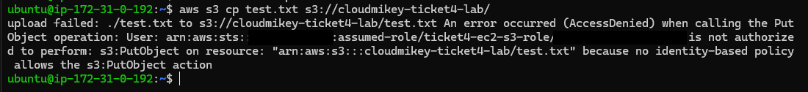
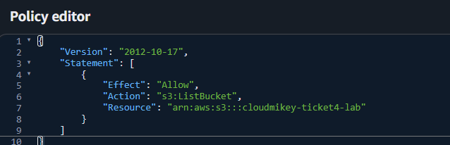
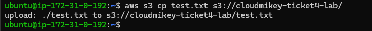
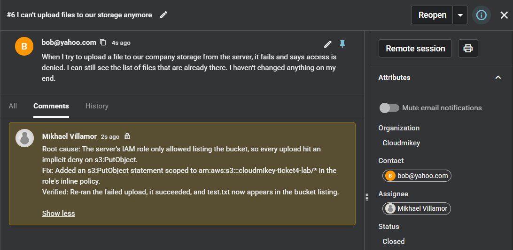

# RCA — S3 Upload Fails With AccessDenied While Listing Still Works

**Spiceworks Ticket:** #6 — Closed · Full lifecycle: reported → triaged (internal note) → closed

> **Lab note:** the fault was injected by attaching a new IAM role (`ticket4-ec2-s3-role`) to the EC2 instance, with an inline policy granting `s3:ListBucket` only. The bucket (`cloudmikey-ticket4-lab`) was created with all default settings, so the role's policy was the only variable. The error, diagnosis and fix are identical to a role that was under-scoped by mistake.

## 1. Symptom
Customer reported (Spiceworks ticket #6, *"I can't upload files to our storage anymore"*): "When I try to upload a file to our company storage from the server, it fails and says access is denied. I can still see the list of files that are already there. I haven't changed anything on my end."

The split is the diagnostic detail. Reading the bucket works and writing to it doesn't. That points away from anything that would break both, such as missing credentials, a wrong bucket name, or the network. It points toward a permission that covers one action but not the other.

## 2. Hypotheses
- **No AWS credentials on the instance** — ruled in first, since "access denied" is also what an unauthenticated caller sees. Ruled out by the error itself, which names the caller as `ticket4-ec2-s3-role` (see Diagnostics).
- **Wrong bucket name** — ruled out on the error text and by listing. A bucket that doesn't exist returns `NoSuchBucket`, not `AccessDenied`, and listing the same bucket succeeded.
- **Bucket policy explicitly denying writes** — ruled out on the error text alone. The message says *no identity-based policy allows* the action, which is an implicit deny. An explicit deny names the policy type that denied it. The bucket also has no bucket policy attached.
- **Block Public Access blocking the upload** — ruled out on reasoning alone. Block Public Access restricts public and anonymous access, and doesn't apply to an IAM role in the same account.
- **The role's policy doesn't grant `s3:PutObject`** — ruled in once the caller was confirmed and reads were proven to work. Confirmed.

## 3. Diagnostics
**Reproducing the failure**
- Ran the customer's action from the instance: `aws s3 cp test.txt s3://cloudmikey-ticket4-lab/`.
- Result: `An error occurred (AccessDenied) when calling the PutObject operation: User: arn:aws:sts::[redacted]:assumed-role/ticket4-ec2-s3-role/[redacted] is not authorized to perform: s3:PutObject on resource: "arn:aws:s3:::cloudmikey-ticket4-lab/test.txt" because no identity-based policy allows the s3:PutObject action`.
- The error states who called, what action failed, on which resource, and why. Credentials exist, since AWS identified the role. The resource is an **object** ARN (`/test.txt`), not the bucket.

**Testing read vs. write**
- Ran `aws s3 ls s3://cloudmikey-ticket4-lab`.
- Result: empty output, no error. The bucket was empty at this point, so silence means success.
- `s3:ListBucket` is allowed on the same bucket with the same credentials. This rules out a wrong bucket name, the network and the endpoint, and matches the customer's "I can still see the list of files."

**Reading the policy**
- Opened the role's inline policy `ticket4-s3-list-only` in the IAM console.
- Result: one statement, `Allow` · `s3:ListBucket` · `arn:aws:s3:::cloudmikey-ticket4-lab`.
- No statement grants `s3:PutObject`, and nothing covers the bucket's objects (`arn:aws:s3:::cloudmikey-ticket4-lab/*`). IAM denies anything not explicitly allowed. **Root cause confirmed.**

## 4. Root Cause
The instance's IAM role allowed `s3:ListBucket` on the bucket but had no statement allowing `s3:PutObject` on the bucket's objects, so every upload hit IAM's default implicit deny. Listing and uploading are separate actions scoped to different ARNs (bucket vs. `bucket/*`), which is why one worked and the other didn't.

## 5. Fix + Prevention
- Added a second statement to `ticket4-s3-list-only`: `Allow` · `s3:PutObject` · `arn:aws:s3:::cloudmikey-ticket4-lab/*`.
  - It's a separate statement because `PutObject` acts on object ARNs. Adding it to the existing bucket-ARN statement would still be denied.
  - Granted only the missing action, not `s3:*`. The customer needed to upload, not delete or change bucket settings.
- Verified against the customer's actual symptom by retrying the exact upload that had failed: `aws s3 cp test.txt s3://cloudmikey-ticket4-lab/` returned `upload: ./test.txt to s3://cloudmikey-ticket4-lab/test.txt`.
- Confirmed the object was stored, not just sent: `aws s3 ls s3://cloudmikey-ticket4-lab` returned `21 test.txt`.
- Logged the triage summary as an internal note on Spiceworks ticket #6 and closed the ticket once the upload succeeded.
- **Prevention:** before attaching a role, test every action the workload needs, both reads and writes, for example with the IAM Policy Simulator. Keep bucket-level actions (`ListBucket`) and object-level actions (`GetObject`, `PutObject`) in separate statements so the ARN scoping is visible at a glance. When an `AccessDenied` arrives, read the action and resource out of the error and grant exactly that, rather than widening the policy until it works.

