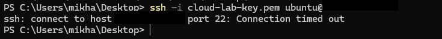
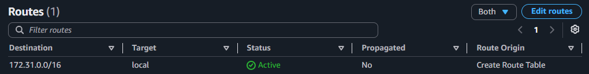
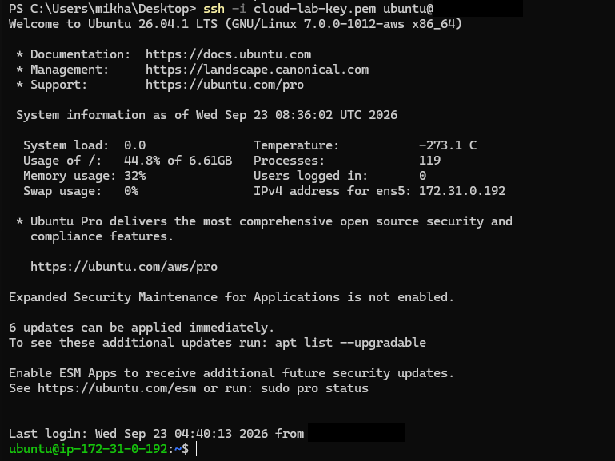
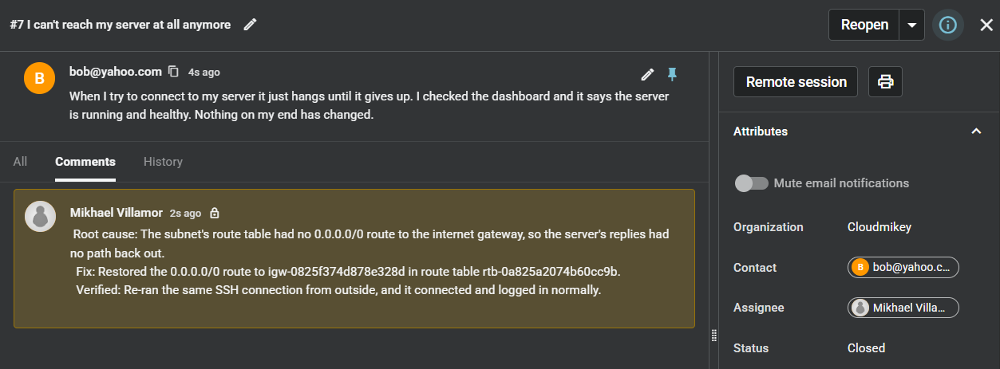

# RCA — Instance Unreachable While Running and Healthy (Missing Internet Gateway Route)

**Spiceworks Ticket:** #7 — Closed · Full lifecycle: reported → triaged (internal note) → closed

> **Lab note:** the fault was injected by removing the `0.0.0.0/0 → igw-0825f374d878e328d` route from `rtb-0a825a2074b60cc9b`, the main route table of the default VPC in us-west-1. Before removing it, I confirmed that this instance was the only resource in the VPC: its subnet showed 4,090 of 4,091 usable addresses free, and the second subnet showed all 4,091 free. That kept the blast radius to this one instance. The error, diagnosis and fix are the same as for a route deleted or changed by mistake.

## 1. Symptom
Customer reported (Spiceworks ticket #7, *"I can't reach my server at all anymore"*): "When I try to connect to my server it just hangs until it gives up. I checked the dashboard and it says the server is running and healthy. Nothing on my end has changed."

"Hangs until it gives up" means packets are being dropped silently, not refused. That's the same signature as [Ticket 1](../../linux/01-ssh-timeout-vs-permission-denied/RCA.md), where the cause was a missing security group rule. The difference is the customer's second detail: the server reports as running and healthy. That rules out the instance before any command is run, and it means every layer between the customer and the instance has to be checked in order, not just the first one that fits.

## 2. Hypotheses
- **Instance down or OS hung** — ruled out by the console. The instance was running with 3/3 status checks passing (see Diagnostics).
- **Public IP changed** — ruled out. The instance was never stopped, so its public IP stayed the same, and the same address was used before and after the fault.
- **Security group missing the SSH rule** — ruled in first because it's the most common cause of this exact timeout (Ticket 1). Ruled out: port 22 was allowed from the customer's exact current IP.
- **Network ACL blocking traffic** — ruled in next because NACLs are stateless and can explicitly deny either direction. Ruled out: inbound and outbound were both the default allow-all.
- **Subnet route table has no path to the internet** — ruled in once every filter had been shown to allow the traffic. Confirmed.

## 3. Diagnostics
**Reproducing the failure**
- Ran `ssh -i cloud-lab-key.pem ubuntu@[redacted]` from outside the VPC.
- Result: `ssh: connect to host [redacted] port 22: Connection timed out`.
- The TCP handshake never completed and no refusal came back, so something along the path dropped the traffic. That rules out authentication, which is only reached after the handshake. The error alone can't say which layer dropped it.

**Checking the instance**
- Checked the instance in the EC2 console.
- Result: `Running` · `3/3 checks passed`, with no open or upcoming health events and EC2 operating normally in the region.
- The system check rules out AWS hardware, and the instance check rules out the OS and its network interface. The customer's "running and healthy" is confirmed. The fault is outside the instance.

**Checking the security group**
- Read the instance's security group inbound rules.
- Result: `22 · TCP · [redacted]/32`, which matched the customer's current public IP.
- SSH is allowed from the right source. This rules out Ticket 1's cause, even though the error is identical.

**Checking the network ACL**
- Read `acl-018de3efa8c2f6041`, the subnet's NACL, in both directions.
- Result: inbound and outbound both `100 · All traffic · 0.0.0.0/0 · Allow`, then `* · Deny`.
- Rules are evaluated lowest number first, so rule 100 allows everything before the catch-all deny is reached. Because a NACL is stateless, the outbound side matters too: it has to allow the SSH reply to the client's ephemeral port. It does. **NACL ruled out.**

**Checking the route table**
- Read the routes on `rtb-0a825a2074b60cc9b`, the table associated with the instance's subnet `subnet-04685ccd63269a5e6`.
- Result: `Routes (1)` · `172.31.0.0/16 → local`.
- There is no `0.0.0.0/0` route to the internet gateway. Every filter allowed the traffic, but the instance's replies to an internet address had no route out of the VPC. The traffic was permitted but unroutable. **Root cause confirmed.**

## 4. Root Cause
The subnet's route table had no `0.0.0.0/0` route to the internet gateway, so the instance's replies to the customer had no path out of the VPC and were dropped. The instance, its security group and its NACL were all healthy and allowing the traffic. A public IP only works when the subnet routes internet-bound traffic through an internet gateway.

## 5. Fix + Prevention
- Restored the route `0.0.0.0/0 → igw-0825f374d878e328d` in `rtb-0a825a2074b60cc9b`, and confirmed the table showed two routes again.
- Verified against the customer's actual symptom by retrying the exact connection that had failed: `ssh -i cloud-lab-key.pem ubuntu@[redacted]` completed the handshake and logged in to `ubuntu@ip-172-31-0-192`. The route was the only change between the failed and successful attempts.
- Logged the triage summary as an internal note on Spiceworks ticket #7 and closed the ticket once the connection succeeded.
- **Prevention:**
  - Alert on route table changes. CloudTrail records `DeleteRoute` and `ReplaceRoute`, and an EventBridge rule on those events catches the change as it happens.
  - Don't edit the main route table for workloads. Give public subnets their own explicitly associated route table, so one mistaken edit can't take out every subnet in the VPC.
  - Enable VPC Flow Logs on the subnet. A dropped reply shows up there directly, rather than being found by elimination.

