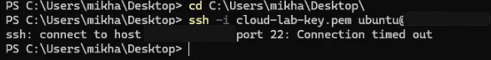
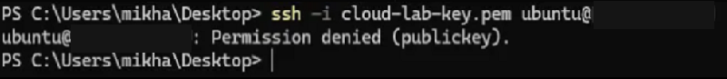
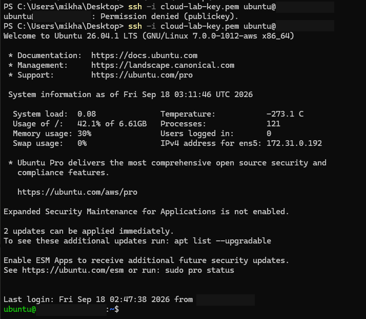
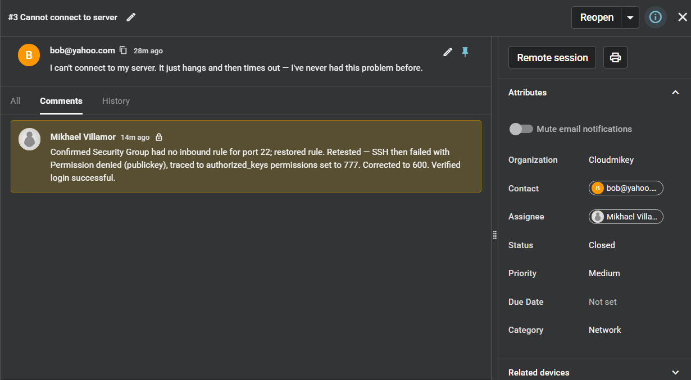

# RCA — SSH: Connection Timed Out vs. Permission Denied (publickey)

**Spiceworks Ticket:** #3 — Closed · Full lifecycle: reported → triaged (internal note) → closed

## 1. Symptom
Customer reported (Spiceworks ticket #3, *"Cannot connect to server"*): "I can't connect to my server. It just hangs and then times out — I've never had this problem before."

Investigation surfaced two independent failure modes on the same instance — the network-layer block that matches the customer's exact complaint, and a second, authentication-layer failure that only appeared after the first fix was verified and the connection retested.

## 2. Hypotheses
- **Network-layer block** (Security Group, NACL, routing) — ruled in first since it's the most common cause and cheapest to check, and matches the customer's description ("hangs and times out").
- **Instance not running / crashed** — ruled out; instance was confirmed running in the console before testing.
- **Wrong key file / wrong username** — ruled out; same key and `ubuntu` user used successfully earlier in the session.
- **Auth-layer rejection** (bad key permissions on the server, corrupted `authorized_keys`) — not part of the original report, but considered once the network-layer fix was verified and a second failure appeared on retest.

## 3. Diagnostics
**Issue 1 — Connection timed out (matches the reported symptom)**
- Removed the port 22 inbound rule from the instance's Security Group (`launch-wizard-1`).
- Ran `ssh -i cloud-lab-key.pem ubuntu@<EC2_PUBLIC_IP>`.
- Result: `ssh: connect to host <EC2_PUBLIC_IP> port 22: Connection timed out`.
- This eliminates auth, DNS, and the instance itself as causes — the TCP handshake never completed, meaning the packet was silently dropped before reaching sshd. That signature is specific to a stateful firewall drop (Security Group), not a refused connection.

**Issue 2 — Permission denied (publickey) (surfaced during retest, not part of the original ticket)**
- Restored the port 22 rule, confirmed login worked.
- Ran `chmod 777 ~/.ssh/authorized_keys` on the instance.
- Ran `ssh -i cloud-lab-key.pem ubuntu@<EC2_PUBLIC_IP>`.
- Result: `ubuntu@<EC2_PUBLIC_IP>: Permission denied (publickey)`.
- This eliminates the network layer — the TCP/SSH handshake completed and the server actively responded with a rejection, rather than staying silent. `sshd` refuses to trust an `authorized_keys` file that's group- or world-writable, regardless of whether the key itself is valid.

## 4. Root Cause
Two independent causes producing two distinguishable errors:
1. Security Group had no inbound rule for port 22 → connection timed out at the network layer (the reported symptom).
2. `authorized_keys` permissions were `777` (world-writable) → `sshd` rejected the otherwise-valid key at the auth layer (found during verification, not reported by the customer).

## 5. Fix + Prevention
- Re-added the port 22 inbound rule scoped to `<HOME_IP>/32` (not `0.0.0.0/0`).
- Ran `chmod 600 ~/.ssh/authorized_keys` to restore the owner-only permissions `sshd` requires.
- Verified with a clean login on both fixes.
- Logged the full triage summary as an internal note on Spiceworks ticket #3 and closed the ticket once both fixes were confirmed.
- **Prevention:** monitor Security Group changes via CloudTrail/EventBridge for unexpected rule deletions; a bootstrap script or `cron` check could periodically enforce `600` on `authorized_keys` to catch accidental `chmod` mistakes before they lock out access.

