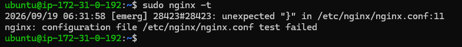
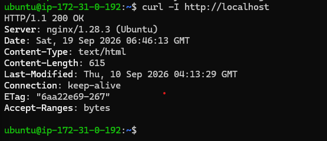
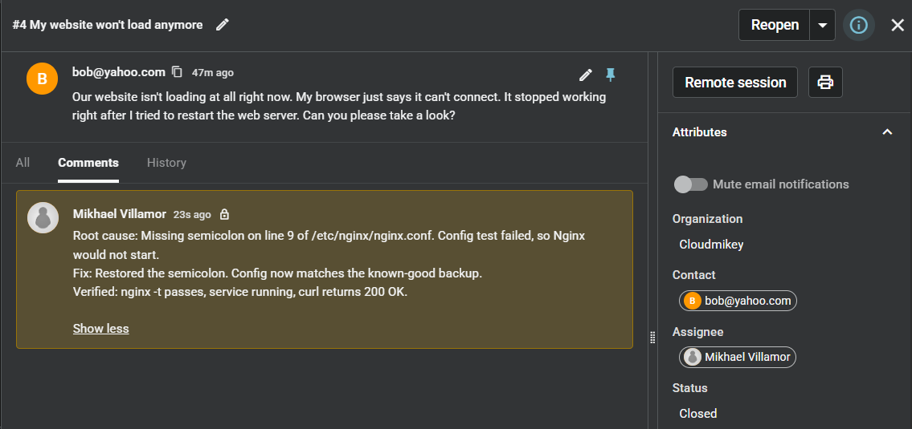

# RCA — Nginx: Service Fails to Start After Config Change

**Spiceworks Ticket:** #4 — Closed · Full lifecycle: reported → triaged (internal note) → closed

## 1. Symptom
Customer reported (Spiceworks ticket #4, *"My website won't load anymore"*): "Our website isn't loading at all right now. My browser just says it can't connect. It stopped working right after I tried to restart the web server."

"Can't connect" rather than an error page is the diagnostic detail — a browser that gets no response at all means nothing is listening on port 80, so the web server is down rather than serving a bad page. The customer also tied the outage directly to a restart, which points at the configuration the service re-reads on start.

## 2. Hypotheses
- **Config syntax error** — ruled in first; a service that ran until it was asked to re-read its config points at the config, and the customer tied the outage to a restart.
- **Port 80 already bound by another process** — ruled out; a stale process holding the port produces the same generic systemd failure, but the journal showed Nginx never reached the bind (see Diagnostics).
- **Upstream failure returning 502/504** — ruled out on the report alone; a 502 or 504 is a response, and the customer was getting no response at all.
- **Instance or network-layer problem** — ruled out; SSH to the instance worked throughout and the Security Group was never modified.

## 3. Diagnostics
**Reproducing the failure**
- Ran `sudo systemctl restart nginx`.
- Result: `Job for nginx.service failed because the control process exited with error code.`
- systemd confirms the start failed but names no cause — no file, no line, no reason. The diagnosis has to come from the config test and the journal.

**Isolating the fault**
- Ran `sudo nginx -t` to parse the config without touching the service.
- Result: `[emerg] unexpected "}" in /etc/nginx/nginx.conf:11` · `configuration file /etc/nginx/nginx.conf test failed`.
- `[emerg]` severity confirms the config could not be loaded at all. This is the detail systemd omitted.

**Locating the actual mistake**
- Line 11 is where the parser gave up, not necessarily where the error is. Ran `grep -n -A1 "worker_connections" /etc/nginx/nginx.conf`.
- Result: line 9 reads `worker_connections 768` with no terminating semicolon; line 10 is a comment.
- Without its semicolon the directive is unfinished, so the parser kept consuming tokens, skipped the comment on line 10, and hit the closing brace on line 11 where a value or semicolon should have been.

**Eliminating the port conflict**
- Ran `sudo journalctl -xeu nginx --no-pager`.
- Result: `An ExecStartPre= process belonging to unit nginx.service has exited` with `status=1/FAILURE`.
- The `nginx.service` unit validates the config in an `ExecStartPre=` step before launching the server. That pre-start check failed, so the main Nginx process — the only one that binds port 80 — never started. A port conflict was not merely unobserved but impossible. No `bind()` or "Address already in use" entry appears anywhere in the journal.

## 4. Root Cause
A missing terminating semicolon on line 9 of `/etc/nginx/nginx.conf` (`worker_connections 768`) made the file unparseable. Because `nginx.service` validates the config in an `ExecStartPre=` step, the invalid file failed that pre-start check and the service never started — taking the site offline the moment the customer restarted it.

## 5. Fix + Prevention
- Restored the semicolon on line 9 with `sudo nano +9 /etc/nginx/nginx.conf`.
- Verified the repair against the backup taken before the change: `diff /etc/nginx/nginx.conf /etc/nginx/nginx.conf.bak` returned no output, meaning the two files are byte-for-byte identical. A matching file size alone would not have proved this.
- Confirmed the config parses (`sudo nginx -t` → `syntax is ok` / `test is successful`), started the service (`sudo systemctl start nginx`), then verified against the customer's actual symptom with `curl -I http://localhost` → `HTTP/1.1 200 OK`. A passing config test proves only that the file parses; the HTTP response is what proves the outage is over.
- Logged the triage summary as an internal note on Spiceworks ticket #4 and closed the ticket once the 200 response confirmed service was restored.
- **Prevention:** run `nginx -t` *before* every restart or reload — the test is non-destructive and catches the fault while the old config is still serving traffic, so an invalid file never reaches the service manager. Back up the config before editing it; the backup is what turned "it seems to work again" into a provable restoration.

