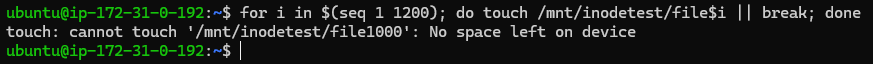
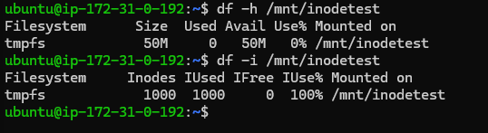
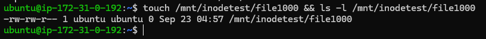
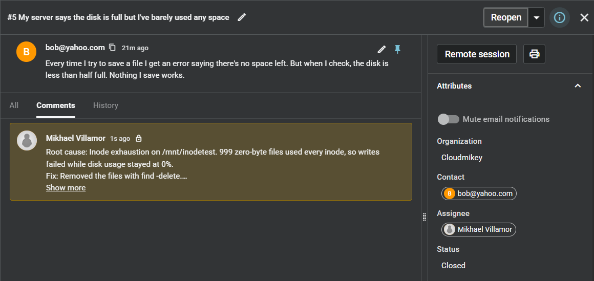

# RCA — Disk "Full" While Disk Usage Shows Free Space (Inode Exhaustion)

**Spiceworks Ticket:** #5 — Closed · Full lifecycle: reported → triaged (internal note) → closed

> **Lab note:** staged on a dedicated tmpfs mount (`/mnt/inodetest`, 50 MB, capped at 1,000 inodes) rather than the root filesystem. Exhausting inodes on the root disk of a running instance risks breaking logging, package management and SSH logins. The kernel behaviour, error and diagnosis are identical.

## 1. Symptom
Customer reported (Spiceworks ticket #5, *"My server says the disk is full but I've barely used any space"*): "Every time I try to save a file I get an error saying there's no space left. But when I check, the disk is less than half full. Nothing I save works."

The contradiction is the diagnostic detail. The error says the filesystem is full, but the customer's own check says it isn't. Either the check is looking at the wrong filesystem, or the error refers to a limit the check doesn't measure.

## 2. Hypotheses
- **Filesystem out of disk space** — ruled in first, since it's what the error literally says and it's the cheapest check. Ruled out by `df -h` (see Diagnostics).
- **Filesystem out of inodes** — ruled in once space was eliminated. The kernel returns the same `ENOSPC` error ("No space left on device") when either limit runs out, and `df -h` doesn't report inodes at all. Confirmed.
- **Permissions problem** — ruled out on the error text alone. A permissions failure returns `Permission denied`, not `No space left on device`.
- **Filesystem mounted read-only** — ruled out on the error text alone. That returns `Read-only file system`.

## 3. Diagnostics
**Reproducing the failure**
- Created empty files in a loop until a write failed: `for i in $(seq 1 1200); do touch /mnt/inodetest/file$i || break; done`.
- Result: `touch: cannot touch '/mnt/inodetest/file1000': No space left on device`.
- Every file was 0 bytes, so each one cost an inode but no data. Files 1–999 succeeded; file 1000 failed.

**Testing space vs. inodes**
- Ran `df -h /mnt/inodetest` on the filesystem where the write failed.
- Result: `Size 50M · Used 0 · Avail 50M · Use% 0%` — identical to the baseline taken before any files were created. **Space ruled out**, and the customer's "less than half full" confirmed.
- Ran `df -i /mnt/inodetest`.
- Result: `Inodes 1000 · IUsed 1000 · IFree 0 · IUse% 100%`. **Inode exhaustion confirmed.**
- `df -h` has no inode column, which is why the customer's check showed a healthy disk.

**Locating the culprit**
- Ran `du --inodes /mnt/inodetest`, which counts files per directory rather than bytes.
- Result: `1000` — all inodes in one directory (999 files plus the directory itself), matching `df -i` exactly.
- `du -sh` would have reported this directory as `0` and hidden it. On a real server the equivalent sweep is `sudo du --inodes -x / | sort -nr | head`, drilling down from the largest count.

## 4. Root Cause
The filesystem ran out of inodes, not bytes. 999 zero-byte files consumed every inode, so no new file could be created at any size. Because the kernel reports both limits with the same `No space left on device` error and `df -h` shows only bytes, the disk appeared to have plenty of room.

## 5. Fix + Prevention
- Removed the files with `find /mnt/inodetest -type f -name 'file*' -delete`. `find -delete` removes files one at a time instead of expanding a shell wildcard, so it doesn't fail with `Argument list too long` when there are millions of files.
- Verified the inodes were released: `df -i` returned to `IUsed 1 · IFree 999 · IUse% 1%`, matching the baseline.
- Verified against the customer's actual symptom by retrying the exact write that had failed: `touch /mnt/inodetest/file1000 && ls -l /mnt/inodetest/file1000` created the file successfully. Free inodes prove capacity is back; a successful write proves the customer can save again.
- Logged the triage summary as an internal note on Spiceworks ticket #5 and closed the ticket once the write succeeded.
- **Prevention:** alarm on inode usage (`df -i`) alongside disk usage — most default disk monitoring watches bytes only, which is exactly the blind spot this ticket fell through. Identify and fix whatever generates the small files (session files, cache fragments, mail queues, unrotated logs split into many files) rather than repeatedly deleting them. On ext4 the inode count is fixed at filesystem creation and cannot be raised later, so the fix is always removing files or rebuilding the filesystem.

